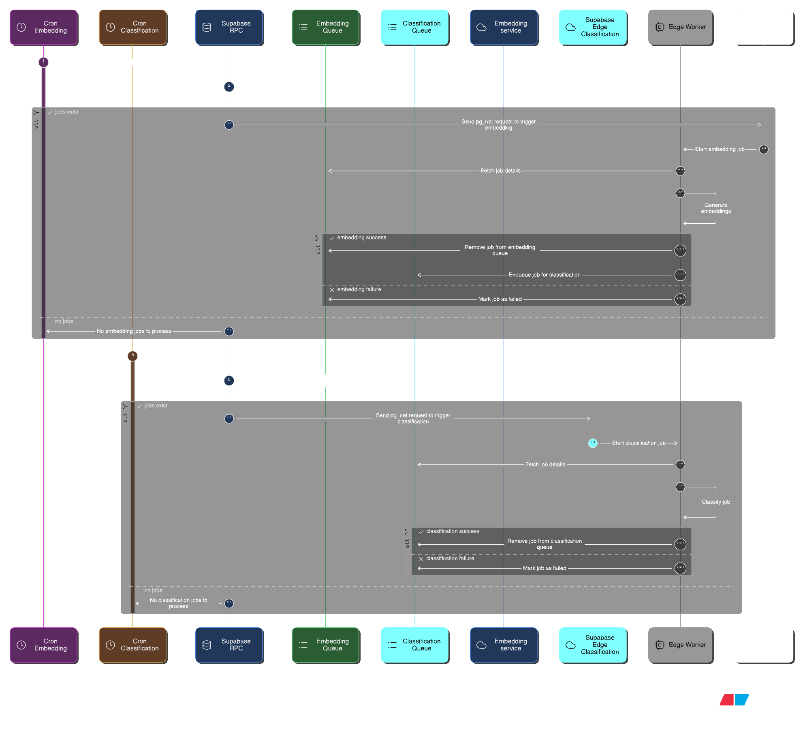
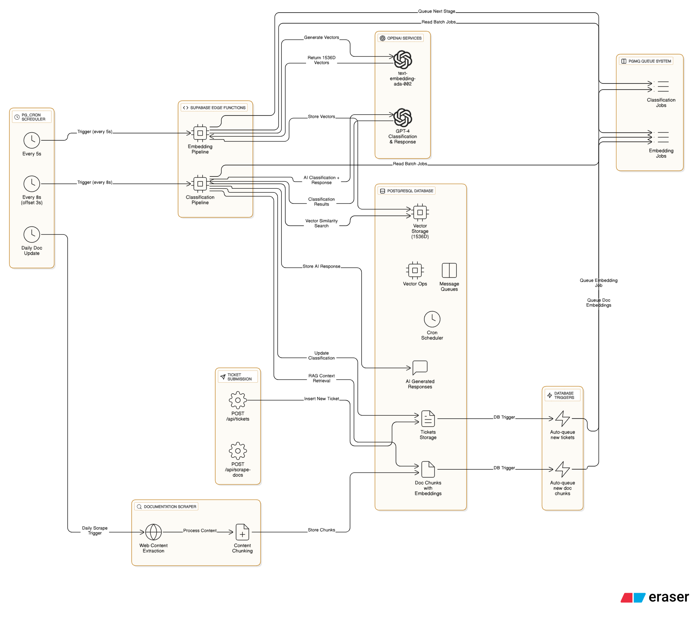

# Atlan Ticketing & AI Classification Platform

A modern ticketing system built with **Next.js**, **Supabase**, and **a queue-cron classification worker**.  
This project enables seamless support ticket management, automated classification, and intelligent response generation for customer queries.

---

## Architecture Overview

<!-- Architectural Diagrams -->
<p align="center">
  
</p>
<p align="center">
  
</p>

- **AI Embedding & Classification Pipeline:**  
  - Incoming tickets are enqueued for processing via a queue system.
  - Edge function workers pick up jobs from the queue to perform semantic embedding (using external models like OpenAI or HuggingFace).
  - Embeddings are stored in Supabase for similarity search and retrieval.
  - Classification models analyze ticket content for:
    - Topic tags
    - Sentiment
    - Priority
  - A cron job service regularly triggers edge function workers to process new or pending tickets, ensuring timely embedding and classification.
  - AI-generated responses are created using LLMs, with references and confidence scores.

---

## Backend Embedding & Classification Pipeline

This section describes the backend pipeline for ticket embeddings and classification, detailing the workflow from ticket submission to AI-powered classification and reference retrieval.

### 1. Ticket Submission

- Users or admins submit tickets via the UI or batch upload.
- Each ticket contains metadata (id, subject, description, name, email).
- Upon creation, tickets are immediately added to a processing queue.

### 2. Queueing System

- A queue system (a pgmq queue) tracks tickets awaiting embedding and classification.
- Each new ticket is enqueued with its metadata and status.

### 3. Embedding Generation

- Edge function workers or serverless jobs monitor the queue for new tickets.
- For each ticket, the worker:
  - Generates a semantic vector embedding for the ticket description using external AI models (e.g., OpenAI, HuggingFace).
  - Stores the embedding in Supabase for fast similarity search and retrieval and enqueue a job for classification queue once embeddings are generated.

### 4. Classification

- The worker analyzes the ticket text using AI models to assign:
  - **Topic tags** (e.g., "Snowflake", "Lineage", "Integration")
  - **Sentiment** (e.g., "frustrated", "curious", "neutral")
  - **Priority** (e.g., "high", "medium", "low")
- Classification results are saved with the ticket record for downstream use.

### 5. Reference Document Retrieval

- Using the generated embedding, the system performs a similarity search against a corpus of reference documents stored in Supabase.
- The most relevant documents are retrieved and attached to the ticket for context and support.

### 6. Similar Ticket Search

- The embedding is also used to search for similar tickets in the database.
- Similar tickets are surfaced to help admins identify recurring issues and leverage previous solutions.

### 7. Cron Services & Triggers

- A cron job service runs at regular intervals to trigger edge function workers.
- Ensures all new or pending tickets are picked up for embedding, classification, and reference retrieval.
- Triggers update ticket status as processing progresses.

### 8. AI Response Generation

- For each ticket, an LLM generates a suggested response, including:
  - Answer text
  - Source references (from similarity search)
  - Confidence score

### 9. Admin Review & Action

- Admins view ticket details, AI analysis, suggested responses, references, and similar tickets.
- Responses can be edited, references selected, and sent to the user.
- Ticket status is updated accordingly.

---

## Documentation Scraper & Reference Embedding Pipeline

To provide high-quality references for ticket responses, the platform includes a documentation scraper pipeline:

### 1. Scraping Atlan Docs & Developer Site

- A custom scraper crawls all links from the Atlan documentation and developer website.
- The scraper recursively discovers and visits all internal documentation pages.
- For each page, it extracts the main content, filtering out navigation, ads, and irrelevant sections.

### 2. Text Extraction & Cleaning

- The scraper parses each page to extract relevant text, such as guides, API docs, troubleshooting steps, and FAQs.
- Extracted text is cleaned and segmented into logical chunks (e.g., paragraphs, sections).

### 3. Embedding Generation for Docs

- Each text chunk is processed using an AI model (e.g., OpenAI, HuggingFace) to generate a semantic vector embedding.
- Embeddings, along with metadata (URL, title, section), are stored in Supabase.

### 4. Reference Retrieval for Tickets

- When a ticket is processed, its embedding is used to perform a similarity search against the documentation embeddings.
- The most relevant documentation chunks are retrieved and attached to the ticket as references.
- These references help generate accurate, context-aware AI responses for users.

---

## Key Features

- **Batch Ticket Creation:**  
  Easily upload multiple tickets via JSON input, assigning a common name and email.

- **AI-Powered Classification:**  
  Automated tagging, sentiment analysis, and priority assessment for every ticket.

- **Intelligent Response Generation:**  
  LLM-generated answers with relevant references and confidence scores.

- **Admin Dashboard:**  
  Manage tickets, review AI analysis, and send responses with reference selection.

- **Secure & Scalable:**  
  Supabase handles authentication, data storage, and vector embeddings.

---

## Getting Started

1. **Clone the repository:**
   ```bash
   git clone <your-repo-url>
   cd atlan
   ```

2. **Configure environment variables:**
   - Copy `.env.example` to `.env.local`
   - Set your Supabase project URL, anon key, and service role key.

3. **Install dependencies:**
   ```bash
   npm install
   ```

4. **Run the development server:**
   ```bash
   npm run dev
   ```

5. **Access the admin dashboard:**
   - Visit `/admin/tickets` for ticket management.
   - Visit `/admin/tickets/batch` for batch ticket upload.

---

## Feedback & Issues

Please open issues or feature requests in this repository.

---

## License

MIT
